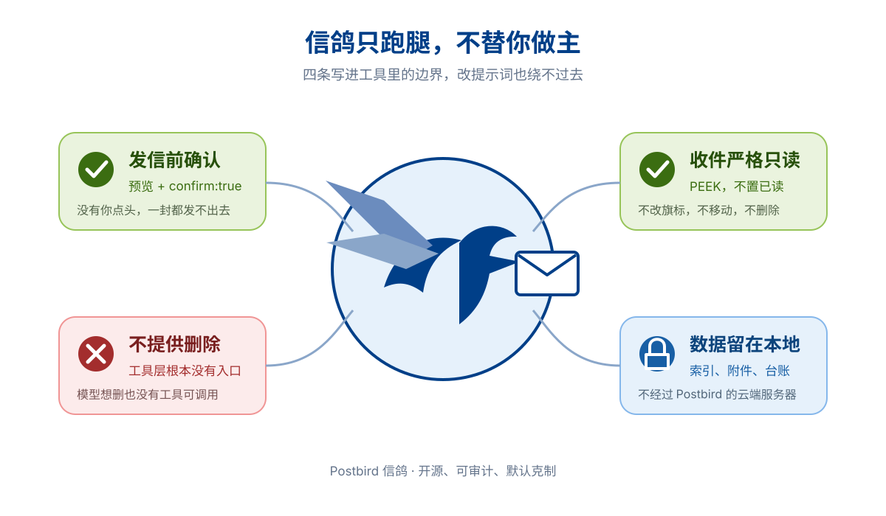

<div align="center">


# Postbird 信鸽

**把邮件和文档交给一句话，把数据和决定权留在自己手里。**

*Local-first AI office toolkit for DeepSeek Harness*

<p>
  <a href="https://github.com/Xplore-LAB/postbird/releases"></a>
  <a href="#底层实现"></a>
  <a href="LICENSE"></a>
  <a href="https://github.com/deepseek-ai/deepseek-harness"></a>
  <a href="#十四个工具"></a>
  <a href="https://nodejs.org"></a>
</p>

简体中文 | [English](README.en.md)

</div>

---

## ⚡ 概览

**Postbird 是 [DeepSeek Harness](https://github.com/deepseek-ai/deepseek-harness) 的本地优先 AI 办公插件。** 它把邮件分诊、安全群发、资料归档、求职台账和 Word / PPT / 表格生成接入同一个对话入口。你说清目标，它调用十四个工具完成任务，并把过程和结果交给你检查。

> **你只需要：** 用自然语言描述任务，按需提供邮箱授权码或本地文件。
>
> **Postbird 会交付：** 可复核的处理结果，以及 `.eml`、`.csv`、`.xlsx`、`.docx`、`.pptx` 等真实文件。

QQ、163、126、Gmail、Outlook 都能接入。收件默认只读，发件必须先预览再确认，邮件索引和生成文件留在你的电脑上。

### 我们的愿景

Postbird 致力于让每个人现有的邮箱和本地文件，直接获得一层可信、可控、可交付的 AI 办公能力。

1. **对个人：** 用一句话整理收件箱、跟踪求职进度、生成文档，把时间留给判断和创造。
2. **对团队：** 把群发、归档、交接和批量制表变成可复核的流程，让经验沉淀成可以重复执行的工作方式。

从一封邮件到一批文档，让重复劳动自动流转，让每次关键决定都回到你手里。


## 🔄 从一句话到可交付结果

1. **说出目标。** 例如“找出最近三天需要回复的邮件”或“按名单生成工资通知”。
2. **读取上下文。** Postbird 检查本地文件，或通过只读 IMAP 获取你授权的邮件。
3. **执行并设防。** 分类和统计直接运行；发信先生成预览，得到你确认后才会投递。
4. **交付结果。** 摘要在对话中展示，文档、表格、邮件和台账写入本地工作目录。

### 看一眼实际效果

```text
你 ：拉一下最近三天的收件，哪些真需要我处理？
AI ：只读拉取 61 封。要办的 3 封：面试邀请、选课通知、网银提醒。
     其余邮件已分为通知、订阅和私信；有 2 封拿不准，等你复核。

你 ：顺便看看我投的公司到哪一步了。
AI ：台账共 11 家：面试中 3 家、笔试 4 家、已投未回 4 家。
     有一封来自个人邮箱的招聘邮件，需要你确认公司归属。

你 ：归到拼多多，导出一份表。
AI ：已更新台账，并写入 track.csv。
```

## 🚀 三步装上

```bash
# 1. 克隆仓库，放进 DSH profile 的 @local 目录
# 仓库名是 postbird，插件包名仍是 @local/dsh-plugin-office
git clone https://github.com/Xplore-LAB/postbird.git
cp -R postbird ~/.dsh/profiles/<profile>/node_modules/@local/dsh-plugin-office
cd ~/.dsh/profiles/<profile>/node_modules/@local/dsh-plugin-office
npm install --omit=dev
rm -rf node_modules/@deepseek-ai node_modules/@standard-schema   # 保持运行时单实例
```

```yaml
# 2. 在 ~/.dsh/profiles/<profile>/cordis.patch.yml 里注册
- insert:
    - id: tool-office
      name: '@local/dsh-plugin-office'
      config:
        imapUser: 'me@qq.com'       # 想收邮件才填
        imapPassEnv: DSH_IMAP_PASS  # QQ/163/126 填授权码，不是登录密码
```

```bash
# 3. 密码只走环境变量，不落配置文件
export DSH_IMAP_PASS='你的授权码'
```

**先不填密码也能用**：文档、PPT、表格、归档检索、统计、邮件草稿，十个工具零配置直接跑。只有真发信（SMTP）和真收信（IMAP）需要授权码，服务器地址按你的邮箱后缀自动认（qq / foxmail / 163 / 126 / gmail / outlook / hotmail / live）。

完整配置项见下方[折叠区](#完整配置项)。

## 先跑通，再谈配置

装完先别急着配邮箱。把 DSH 的工作目录切到仓库的 `example/`，直接说人话：

```text
你 ：看看 example/employees.csv 有哪些列，各是什么类型
你 ：按部门汇总薪资和奖金，输出到 by_dept.xlsx
你 ：按 example/employees.csv 每行生成一份工资通知，标题写「{{name}} 的工资通知」，输出到 letters/
```

三句都不需要任何凭据、不联网、不碰邮箱，几秒钟出结果。实际输出长这样：

```text
employees.csv: 6 rows, 4 columns (2 numeric).
Aggregate by department: 3 group(s) → by_dept.xlsx
  Engineering   salary 75000   bonus 8700
  HR            salary 14000   bonus 1000
  Sales         salary 32000   bonus 3300
office_docgen: 6 files → letters/notice_Alice.docx … letters/notice_Frank.docx
```

文件落地就说明插件挂载成功了，再去配 SMTP / IMAP 也不迟。

## 六件它替你干的事

**给 40 个人各发一封不同的信。**「按 `members.csv` 发中秋通知，称呼用『昵称』列，附件用『附件』列，先给我看预览。」逐行渲染、你点头才发、1.5 秒一封节流、发完留台账。Word 模板加 Excel 名单加 Outlook 合并那套三件套，可以扔了。

**收件箱自己分好堆。**「哪些真需要我处理？」只读拉取（绝不标已读），分成**要办的 / 通知 / 订阅 / 私信**四堆，每条附判定理由（「主题含面试」），拿不准的单独列出等你复核，绝不瞎猜。

**一学期的邮件打包交给下一届。**「全导出来，附件也要。」按发件人、时间段、有无附件筛选，产出 `.eml` 加一份 `index.csv` 清单，附件批量收齐、重名自动加序号。换届交接、收报名简历、「三月那个附件在哪」的考古，都走这条。

**求职台账自己长出来。**「我投的公司到哪一步了？」从邮件识别笔试、面试、offer、拒信，按公司归并，进度**只前进不后退**（迟到的拒信盖不掉已记录的 offer）。HR 用个人邮箱发的信认不出公司，单独放着等你归位。导出 CSV 接着统计。

**看看谁在轰炸你的邮箱。**「哪些订阅值得退？」按发件人排频率榜，带退订链接的直接列出来。**只出主意**，退订、删除、移动一概不代劳。

**顺手的文档四件套。** 按 CSV 每行生成一份 Word 通知书；做一份带表格和图片的 PPT；往现成 `.docx` 模板里填 `{{占位符}}`；表格查看、筛选、汇总、拆分（先摸清列结构再动手）。

## 你是哪种人，先跑哪一句

| 你的处境 | 直接复制这句话 |
|---|---|
| 学生，通知和选课邮件淹过来 | 拉最近三天的收件，把需要我回复的挑出来 |
| 秋招春招投了一堆公司 | 扫收件箱，把投过的公司整理成台账，导出 CSV |
| 社团换届要交接 | 把这一届带附件的邮件全导出来，附件收进 handover/ |
| HR / 行政，发工资条发通知 | 按 employees.csv 发工资条，称呼用 name 列，先给我看预览 |
| 教师助教，按名单批量通知 | 用 notice.docx 模板，按 roster.csv 每人生成一份通知书 |
| 开发数据，表格要清洗 | 看看 data.csv 的结构，筛出 salary 大于 16000 的行，存成 xlsx |

## 十四个工具

| 工具 | 你说什么 | 实际发生什么 |
|---|---|---|
| `office_mail_preview` | "用这个模板渲染 recipients.csv" | 逐行渲染 + 校验，存好，返回 `previewId` |
| `office_mail_send` | "发送预览 pm_1a2b3c，确认" | 草稿模式写 `.eml`（无需 SMTP），或节流投递 + JSONL 台账 |
| `office_inbox_fetch` | "拉取最近 20 封收件" | 只读 IMAP（PEEK，不置已读），元数据 + 摘要落本地索引 |
| `office_inbox_triage` | "分诊昨晚收到的邮件" | 确定性规则分四桶，每条附判定理由 |
| `office_archive_search` | "找带附件的 offer 邮件" | 本地索引检索：发件人 / 主题 / 时间 / 附件 / 分类，零网络 |
| `office_archive_export` | "把这届社团的邮件打包交接" | 匹配邮件只读重取，落 `.eml` + `index.csv` |
| `office_archive_attach` | "把报名邮件里的简历都收下来" | 附件存进工作目录，文件名去重，大小 / 类型上限 |
| `office_stats_overview` | "这学期我收发了多少邮件" | 月度趋势、常用联系人、分类构成，纯本地统计 |
| `office_stats_track` | "我的求职进展到哪一步了" | 自动台账 已投→笔试→面试→offer（只前进）+ 手动修正 + CSV |
| `office_inbox_clean` | "哪些订阅值得退掉" | 按发件人排频率榜 + 退订链接；只出建议，绝不代劳 |
| `office_docgen` | "按 employees.csv 每行生成一份通知书" | 每行一份 `.docx`，`{{字段}}` 引擎，拒绝静默覆盖 |
| `office_pptx` | "做一份 5 页的季度汇报" | 幻灯块生成 `.pptx`，支持批量 |
| `office_template` | "按 clients.csv 每行填充合同模板" | 模板内占位符替换，跨 run 拆分安全 |
| `office_sheet` | "按部门汇总工资输出 xlsx" | groupBy + sum/avg/min/max/count，输出 `.csv` / `.xlsx` |

## 为什么是它

主流 AI 办公工具有两道墙：**订阅费**（Superhuman $30/月、Fyxer $22.5/月）和**邮箱生态**（Shortwave 只支持 Gmail，开源标杆 inbox-zero 靠 OAuth 锁死 Gmail 和 Microsoft，QQ / 163 用户整个被排除在外）。

| | 网页版邮箱 | Copilot 类 | MCP 邮件服务器 | Postbird for DSH |
|---|---|---|---|---|
| 花费 | 免费 | 按月订阅 | 免费 | 免费（MIT） |
| 邮箱 | 只有自家 | 绑死生态 | 通吃 | 通吃，QQ/163 一视同仁 |
| 数据在哪 | 服务商 | 厂商云端 | 本地 | 本地，零上传 |
| 危险操作 | 手动 | 厂商说了算 | `delete_email` 直给模型 | **没有删除工具**，发信强制两阶段 |
| 场景 | 通用 | 通用 | 通用原语 | 求职台账、换届归档等成套闭环 |

一句话：**「免费邮箱 + 数据本地 + 场景开箱即用」这个交集，现在没别人站着。** 详细版图见[竞品对比](docs/COMPETITORS.zh-CN.md)。

诚实的短板也摆出来：没有预写回复（对手标配）、没有实时监听、单账户、只能在 DSH 里用。

## 信鸽不做的事

送信的鸟不该替主人做主，这套工具的护栏就是照这条画的。



- **发信必须过两道门。** 没有预览 + `confirm:true`，一封都发不出去。收件人上限、逐封节流、域名白名单、只追加台账。
- **收信严格只读。** 正文用 PEEK 拉取（绝不标已读），不改旗标、不删信，本地只存元数据加 300 字摘要。
- **清理只出主意。** 退订、删除、移动，一概不代劳。Postbird **没有任何删除邮件的工具**，想删也删不了。
- **文件不出界。** 导出和附件下载锁死工作目录，带显式上限；表格里的恶意单元格没法把目录外的文件当附件发出去。
- **出错就大声报。** 缺 `{{字段}}` 直接报错并指名字段，绝不带着占位符出仓；输出绝不悄悄覆盖。
- **密码不落盘。** SMTP 和 IMAP 凭据只从环境变量读。

不宣称「比大厂更安全」，准确的说法是威胁面不同，而且每一块都握在你自己手里。完整威胁模型见 [SECURITY.md](SECURITY.md)。

## 数据落在哪，怎么卸干净

```text
~/.dsh/office/mail/
├── index.jsonl        收件索引：日期、发件人、主题、300 字摘要、附件名、分类证据
├── sent-log.jsonl     发信台账，只追加
├── job-track.json     求职台账
├── previews/          邮件合并的预览快照
└── drafts/<id>/       草稿模式产出的 .eml
```

只有 `index.jsonl` 含摘要，邮件全文和附件在你明确导出时才落盘到工作目录。想清空收件索引：`rm -rf ~/.dsh/office/mail`。卸插件：删掉 `node_modules/@local/dsh-plugin-office` 目录，并从 `cordis.patch.yml` 里移除 `tool-office` 那一段。

### 完整配置项

下面列出全部默认值，只写你要改的那几行即可。

```yaml
config:
  # 发信（真发才需要；草稿模式一个都不用配）
  smtpHost: smtp.qq.com        # 留空则只能出草稿 .eml
  smtpPort: 465                # 465 隐式 TLS，587 STARTTLS
  smtpSecure: true
  smtpUser: ''
  smtpPassEnv: DSH_SMTP_PASS   # QQ/163/126 填授权码，不是登录密码
  fromAddress: ''
  fromName: ''
  replyTo: ''
  maxRecipients: 50            # 单批收件人上限
  sendIntervalMs: 1500         # 两封之间的最小间隔
  dailySendCap: 200            # 滚动 24 小时发信上限，防进黑名单
  allowDomains: []             # 空 = 不限；填 ['edu.cn'] 则其他域名在预览阶段就拦下
  previewTtlMinutes: 60        # 预览超时必须重做，防止预览完隔很久才发

  # 文档与表格
  maxDocRows: 100              # 单批文档生成上限
  maxSheetRows: 20000          # 单次读表上限

  # 收信（office_inbox_* 才需要）
  imapUser: 'me@qq.com'
  imapPassEnv: DSH_IMAP_PASS
  imapHost: ''                 # 留空按邮箱后缀自动推导
  imapPort: 993
  imapMailbox: INBOX
  maxInboxFetch: 200           # 单次拉取上限
  inboxSnippetChars: 300       # 本地索引里存的摘要长度
  maxArchiveMessages: 200      # 归档导出 / 附件收取上限
  maxAttachmentMb: 25          # 单附件大小上限，超出跳过并报告
```

调试时可设 `DSH_OFFICE_HOME=/tmp/office-test`，数据目录会整体改道，不碰真实数据。

## 工具调用示例

AI 会替你组装以下参数，人不用手写。

**CSV 批量生成信函**（数据列自动成为 `{{字段}}` 变量）：

```json
{
  "content": [
    { "type": "heading", "level": 1, "text": "{{name}} 的绩效通知" },
    { "type": "paragraph", "text": "尊敬的 {{name}}，您的薪资为 {{salary}}。" },
    { "type": "table", "header": ["项目", "数值"], "rows": [["薪资", "{{salary}}"]] }
  ],
  "dataFile": "employees.csv",
  "outputDir": "letters",
  "filenameTemplate": "letter_{{name}}.docx"
}
```

**表格流水线**，先 inspect 再操作：

```json
{ "file": "employees.csv", "action": "inspect" }
{ "file": "employees.csv", "action": "filter",
  "filter": { "column": "salary", "op": "gt", "value": "16000" },
  "outputPath": "high_paid.csv" }
{ "file": "employees.csv", "action": "aggregate",
  "aggregate": { "groupBy": ["department"], "metrics": [{"column": "salary", "fn": "sum"}] },
  "outputPath": "by_dept.xlsx" }
{ "file": "employees.csv", "action": "split",
  "splitBy": "department", "outputPrefix": "out/dept" }
```

**邮件合并**，预览、确认、再发送：

```json
{ "subjectTemplate": "{{month}} 工资条通知 - {{name}}",
  "bodyTemplate": "{{name}} 您好，……",
  "recipientsFile": "recipients.csv", "attachmentColumn": "attachment" }
{ "previewId": "pm_…", "mode": "send", "confirm": true }
```

**收件与归档**：

```json
{ "limit": 20, "daysBack": 1 }
{ "sinceHours": 24 }
{ "from": "zju.edu.cn", "category": "todo", "hasAttachment": true }
{ "extensions": ["pdf"], "outputDir": "resumes", "workDir": "/path/to/work" }
```

**求职台账**，自动扫描、手动修正、导出：

```json
{ "action": "scan" }
{ "action": "update", "company": "tencent", "status": "offer", "note": "SP，11 月入职" }
{ "action": "export", "outputPath": "track.csv", "workDir": "/path/to/work" }
```

## 常见问题

**要花钱吗？** 插件 MIT 协议免费，只花你本来就在花的 DSH 模型用量。没有订阅、没有云端付费档、没有遥测。

**QQ / 163 / 126 能用吗？** 能。这些邮箱对免费用户开放完整 SMTP 和 IMAP，去邮箱设置里生成一个授权码即可（和登录密码不是一回事）。服务器地址自动推导，不用手填。

**它会不会不经我同意就发信、删信？** 不会。发信必须走「预览 → 你点头 → `confirm:true`」；收件侧设计上就是只读；订阅清理只输出报告。Postbird 里根本没有删除邮件的工具，改配置也绕不过去。

**我的邮件存到哪了？** 本机 `~/.dsh/office/mail/` 下的 JSONL 索引，只有元数据和 300 字摘要。全文和附件只在你明确导出时才落盘，不上传任何地方。

**为什么不直接用 Copilot 或网页版邮箱？** 它们够用就继续用。Postbird 是给被它们跳过的人准备的：付费生态之外的免费邮箱用户，以及想让过程看得见、数据留本地的人。完整分析见 [STRATEGY.zh-CN.md](docs/STRATEGY.zh-CN.md)。

**为什么叫信鸽？** 信鸽只管把信送到，不拆、不回、不扔。这套工具的边界跟这只鸟一样：跑腿全包，做主权归你。

## 排障

| 现象 | 原因 | 怎么办 |
|---|---|---|
| DSH 启动报 schemastery / dsh-tools 相关错 | 插件目录里装进了第二份运行时 | 删掉 `node_modules/@deepseek-ai` 和 `node_modules/@standard-schema` |
| 发信报 `535 Login Fail` | 用了登录密码 | QQ / 163 / 126 要在邮箱设置里开启 SMTP 服务，生成授权码填进 `DSH_SMTP_PASS` |
| IMAP 连不上或认证失败 | IMAP 服务没开，或密码填错 | 邮箱设置里单独开启 IMAP，授权码填进 `DSH_IMAP_PASS` |
| 提示预览已过期 | 默认 60 分钟失效 | 重新预览一次，或调大 `previewTtlMinutes` |
| 附件报 `escapes workDir` | 附件必须放在工作目录内 | 把附件挪进 workDir，用相对路径引用 |
| 提示单批超限 | `maxRecipients` 50、`maxDocRows` 100 | 分批跑，或改配置 |
| 大表读不动 | `maxSheetRows` 上限 20000 | 先 `inspect` 摸清列，再 `filter` 缩小范围后 `aggregate` |
| 工具根本没出现 | `cordis.patch.yml` 缩进或 profile 路径错 | 核对 `- insert:` 的缩进与 `id` / `name` 拼写，profile 名是否填对 |

## 底层实现

原生 Cordis 插件（`defineTool`，无 MCP 中转）。SMTP 走 nodemailer，IMAP 走 ImapFlow + mailparser（同属 Postal Systems 血统，MIT）。文档走 docx / pptxgenjs / exceljs。100 项端到端测试覆盖全部工具和安全护栏：路径逃逸、邮件头注入、覆盖拒绝、台账只前进。

## 给开发者

```text
lib/index.js     14 个工具的注册、schema 与发信护栏
lib/inbox.js     IMAP 收信、本地索引、确定性分诊
lib/archive.js   归档检索 / .eml 导出 / 附件收取
lib/stats.js     邮件统计、求职台账
lib/clean.js     订阅频率榜与退订建议
lib/docgen.js    按数据行批量生成 docx
lib/pptxgen.js   幻灯块生成 pptx
lib/sheet.js     表格 inspect / filter / aggregate / split
lib/docx-inject.js 模板占位符注入（跨 run 拆分安全）
lib/render.js    变量渲染与校验
tests/e2e.mjs    100 项端到端断言
```

跑测试（在挂载后的插件目录里，Node >= 20）：

```bash
cp tests/e2e.mjs ~/.dsh/profiles/web/node_modules/@local/dsh-plugin-office/
cd ~/.dsh/profiles/web/node_modules/@local/dsh-plugin-office && node e2e.mjs
```

测试用 `DSH_OFFICE_HOME` 指向临时目录，不碰你的真实邮件数据。

新增工具有三条 schema 硬规则，违反时只在真实启动阶段暴露（`--dump-config` 或 web 服务起 200 才报错，静态检查抓不到）：

1. object 型的 `items` 必须写 `additionalProperties: true`
2. 数组 `items` 内部禁用 `additionalProperties: false`
3. `additionalProperties` 只接受布尔值

改完用 `--dump-config` 起一次 DSH，确认 14 个工具全部装载且日志无 error。

## 路线图

邮件的六个环节（写 / 发 / 收 / 归档 / 分析 / 清理）已全部覆盖。下一步看真实使用反馈：回复草稿与跟进提醒、结合 DSH 定时任务的每早自动分诊。

各版本的变更说明见 [Releases](https://github.com/Xplore-LAB/postbird/releases)。

## 相关

[word-mail-merge-batch-sender](https://github.com/Xplore-LAB/word-mail-merge-batch-sender)（邮件合并的 VBA/Outlook 初版，Postbird 是它的继任者） · [dsh-plugin-asmemory](https://github.com/Xplore-LAB/dsh-plugin-asmemory)（DSH 持久记忆插件）

延伸阅读：[产品介绍](docs/PRODUCT-INTRO.zh-CN.md)（对话实录版） · [竞品对比](docs/COMPETITORS.zh-CN.md) · [发展策略](docs/STRATEGY.zh-CN.md) · [场景全景地图](docs/MAIL-SCENARIOS.zh-CN.md)

## 许可证

本项目基于 [MIT 许可证](LICENSE) 开源。
